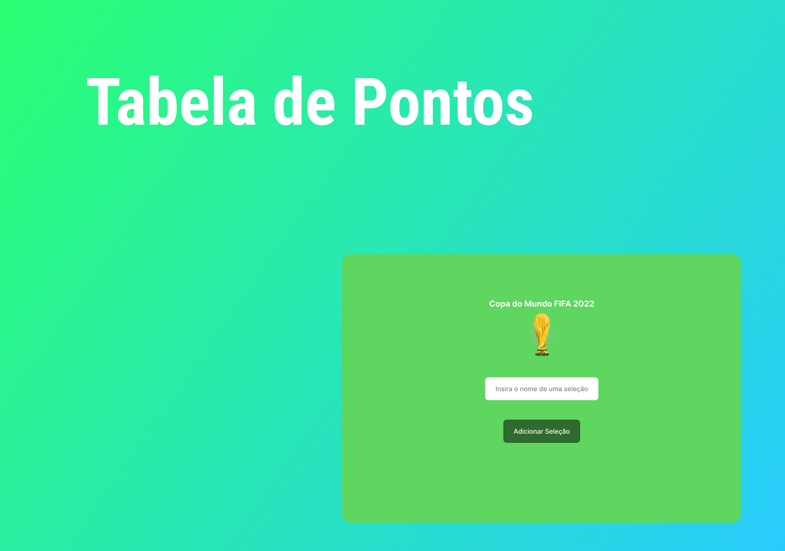

<h1 align="center"> Tabela de Pontos </h1>

Página criada para ser usada como contagem de pontos de seleções de futebol.

  <a href="#-tecnologias">Tecnologias</a>&nbsp;&nbsp;&nbsp;|&nbsp;&nbsp;&nbsp;
  <a href="#-projeto">Projeto</a>&nbsp;&nbsp;&nbsp;|&nbsp;&nbsp;&nbsp;
  <a href="#-layout">Layout</a>&nbsp;&nbsp;&nbsp;|&nbsp;&nbsp;&nbsp;
  <a href="#memo-licença">Licença</a>

  

 

  

## 🚀 Tecnologias

Esse projeto foi desenvolvido com as seguintes tecnologias:

- HTML e CSS
- JavaScript
- Git e Github
- Figma

## 💻 Projeto

A tabela de pontos é capaz de contar o número de vitórias, derrotas e empates de uma seleção na Copa do Mundo, fornecendo o número de pontos conseguidos.

Você pode ter acesso ao projeto online [clicando aqui](https://toddynan.github.io/tabela-pontos).

## 🔖 Layout

Você pode visualizar o layout do projeto através [DESSE LINK](https://www.figma.com/file/IuN6QGzo6odpYvjngJPJDs/DevLinks-(Community)?node-id=90%3A160&t=Ab5vchFlFEuf13So-0). É necessário ter uma conta no [Figma](https://figma.com) para acessá-lo.

## :memo: Licença

Esse projeto está sob a licença MIT.

---

Powered by Alura :wave: